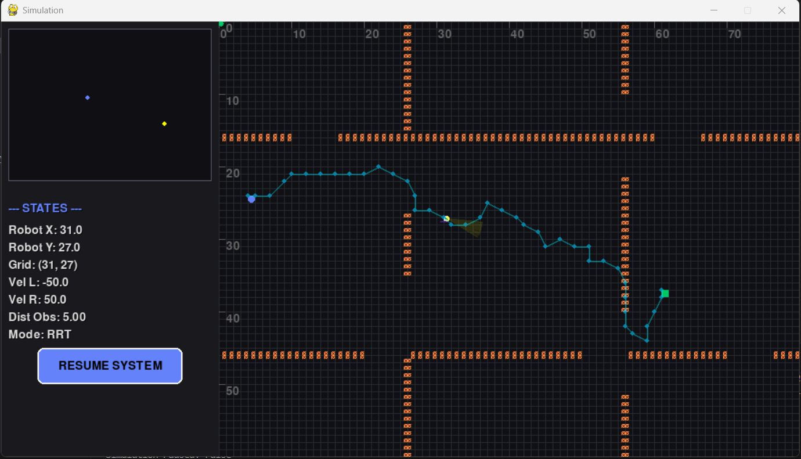
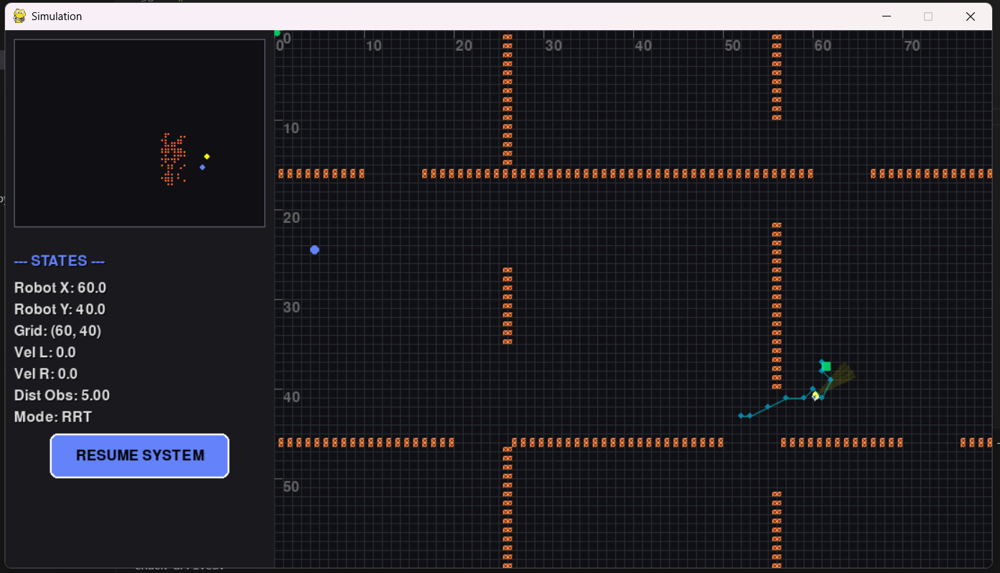

# DifferentialBot RRT Simulator

A 2D simulation of a **differential-drive robot** performing autonomous navigation using the **Rapidly-exploring Random Tree (RRT)** path planning algorithm, built with **PyGame** and **Pymunk**.

The robot explores a hallway-style map, detects obstacles via an ultrasonic sensor, builds a live occupancy map, and follows the RRT-computed path using a **threshold-based heading controller** — all fused through a Kalman Filter.

---

## Screenshots

<p align="center">
  
  &nbsp;
  
</p>

> **Left:** Initial RRT path computed from the robot's start position to the goal (green square). Cyan dots show the generated waypoints through the hallway map.  
> **Right:** Robot replanning — a new RRT path is computed on-the-fly after the ultrasonic sensor detects an obstacle too close.

---

## Features

- **RRT Path Planning** — Rapidly-exploring Random Tree generates a collision-free path from start to goal on-the-fly
- **Differential Drive Physics** — Realistic kinematic model using Pymunk's rigid body simulation
- **Sensor Fusion** — GPS and IMU data fused through a **Kalman Filter** for smooth position estimation
- **Ultrasonic Sensor** — Cone-shaped proximity detection triggers obstacle avoidance and replanning
- **Live Occupancy Mapping** — The robot dynamically records detected obstacle positions
- **Threshold-Based Heading Controller** — Bang-bang steering: spins in place to align heading with each waypoint, then drives forward at full speed
- **Dark Sci-Fi UI** — Real-time sidebar with minimap, robot state telemetry, and Pause/Resume button
- **Embedded hardware stub** — `WheelMotorDrivers` and `UARTReceiver` include commented-out MicroPython (Raspberry Pi Pico) code for real deployment

---

## Project Structure

```
Codes/
├── main.py              # Entry point: simulation loop, rendering, UI
├── RRT_Search.py        # RRT algorithm (node tree, steering, path filtering)
├── Control.py           # High-level controller: path following + replanning logic
├── HeadingController.py # Threshold-based bang-bang heading controller (adjusts left/right wheel speeds)
├── KalmanFilter.py      # 4-state Kalman Filter (x, y, vx, vy) fusing GPS + IMU
├── SensorModules.py     # GPS, IMU and Ultrasonic sensor simulation classes
├── Mapping.py           # Occupancy map builder and path comparison utilities
├── Obstacles.py         # Static obstacle definitions (hallway layout + alternatives)
├── Lines.py             # Trail renderer (GPS trace, Kalman trace, RRT path)
├── WheelMotorDrivers.py # Motor command layer (simulation + Pico GPIO stubs)
└── UARTReceiver.py      # Sensor data aggregator (simulation + UART stubs)
```

---

## Architecture Overview

```
┌──────────────┐     GPS + IMU     ┌─────────────────┐
│ SensorModules│ ────────────────► │  KalmanFilter   │
│  GPS / IMU   │                   │  (x,y,vx,vy)    │
│  Ultrasonic  │                   └────────┬────────┘
└──────┬───────┘                            │ fused state
       │ distance to obstacle               ▼
       │                          ┌──────────────────┐
       └─────────────────────────►│    Controller    │
                                  │  (Control.py)    │
                                  │                  │
                                  │  ┌────────────┐  │
                                  │  │ RRT Search │  │
                                  │  └────────────┘  │
                                  │  ┌────────────┐  │
                                  │  │  Heading   │  │
                                  │  │ Controller │  │
                                  │  └────────────┘  │
                                  └────────┬─────────┘
                                           │ wheel speeds
                                           ▼
                                  ┌──────────────────┐
                                  │ WheelMotorDrivers│
                                  │  Bot (Pymunk)    │
                                  └──────────────────┘
```

**Data flow each frame:**
1. `UARTReceiver` pulls fresh GPS coordinates, IMU angle, and ultrasonic distance
2. `KalmanFilter` predicts & updates the state estimate
3. `Controller` checks for obstacle proximity → triggers backward motion + replanning if needed
4. `RRTPatchSearch` generates a new tree from current position to goal when needed
5. `HeadingController.adjust_wheel_speeds()` applies threshold-based bang-bang steering toward the next waypoint
6. `WheelMotorDrivers` applies speeds to the Pymunk physics body
7. `Mapping` records new obstacle detections into the occupancy map

---

## Requirements

- Python **3.10+**
- [pygame](https://www.pygame.org/) — rendering and event loop
- [pymunk](http://www.pymunk.org/) — 2D rigid body physics
- [numpy](https://numpy.org/) — matrix math for the Kalman Filter

Install all dependencies:

```bash
pip install pygame pymunk numpy
```

---

## Running the Simulation

```bash
cd Codes
python main.py
```

| Control | Action |
|---|---|
| `PAUSE SIMULATION` button | Pause / Resume the physics and control loop |
| Close window | Exit the simulation |

---

## Configuration

Key parameters are defined in `main.py` and the module constructors:

| Parameter | Location | Default | Description |
|---|---|---|---|
| `destination` | `main.py` | `(61, 37)` | Goal position in grid units |
| `tile_size` | `main.py` | `10` px | Grid cell size |
| `MAP_WIDTH / HEIGHT` | `main.py` | `800 × 600` | Simulation canvas size |
| `max_iterations` | `RRT_Search.py` | `3000` | Max RRT tree expansion steps |
| `distance_at_node` | `main.py` | `5` | RRT step size in grid units |
| `process_variance` | `KalmanFilter.py` | `1e-4` | Kalman process noise |
| `measurement_variance_gps/imu` | `KalmanFilter.py` | `1e-2` | Sensor noise covariance |
| Obstacle layout | `Obstacles.py` | `hallway_obstacles` | Swap for `obstacles1`, `obstacles2`, `obstacles3` |

---

## Map Layouts

Three alternative obstacle layouts are available in `Obstacles.py`:

| Function | Description |
|---|---|
| `hallway_obstacles` *(default)* | Hallway map with horizontal/vertical walls and multiple doorway gaps |
| `obstacles1` | L-shaped corridors with horizontal barriers |
| `obstacles2` | Empty map (no obstacles) |
| `obstacles3` | Sparse walls — good for testing open-field RRT |

Switch layouts in `main.py`:
```python
obstacles = Obstacles.hallway_obstacles(tile_size)  # Change this line
```

---

## Hardware Deployment (Raspberry Pi Pico)

The codebase is structured for portability. Both `WheelMotorDrivers.py` and `UARTReceiver.py` contain commented-out **MicroPython** code for Raspberry Pi Pico GPIO control (L298N motor driver via PWM pins).

To deploy:
1. Uncomment the `from machine import Pin` block and GPIO logic in `WheelMotorDrivers.py`
2. Implement real UART read logic in `UARTReceiver.py`'s `refresh_data()` method
3. Replace the sensor simulation calls with actual hardware reads

---

## Algorithm Details

### RRT (Rapidly-exploring Random Tree)
1. Initialize tree with robot's current grid position
2. Sample a random node in the map space
3. Find the nearest existing tree node
4. Steer toward the random node by `distance_at_node` steps
5. If the new node is collision-free (not in `Map.obstacles_coordinates`), add it
6. If within 2 grid units of the goal, terminate and extract the path
7. Path is extracted by traversing parent pointers from the goal-nearest node back to root

### Kalman Filter
State vector: `[x, y, vx, vy]`  
- **Predict:** propagates state with constant-velocity model  
- **Update:** fuses GPS (position) and IMU (velocity) measurements  
- Separate measurement variances allow tuning sensor trust

### Heading Controller (`HeadingController.py`)
A simple **threshold-based (bang-bang) controller** — *not* a PID — that steers the robot toward each RRT waypoint:

```python
alpha      = atan2(yd - y, xd - x)   # Desired angle to next waypoint
angle_diff = alpha - theta            # Heading error

if   angle_diff >  π/15:  → spin left   (L = -50, R = +50)
elif angle_diff < -π/15:  → spin right  (L = +50, R = -50)
else:                     → drive forward at full speed (L = R = 100)
```

- The **deadband** of `π/15` (~12°) prevents oscillation around the target heading
- No integral or derivative terms are used; wheel speeds switch discretely between three fixed states

---

## License

This project is open source. Feel free to use, modify, and build upon it.

---

## Demo Video

[](https://youtu.be/YVPpjKtE6y0)

---

*Built with PyGame + Pymunk · RRT Path Planning · Kalman Filtering · Differential Drive Kinematics*
